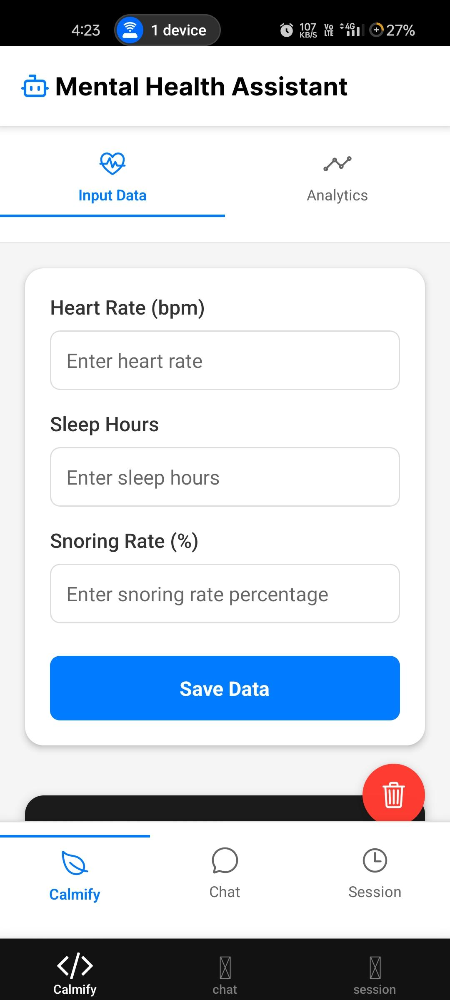
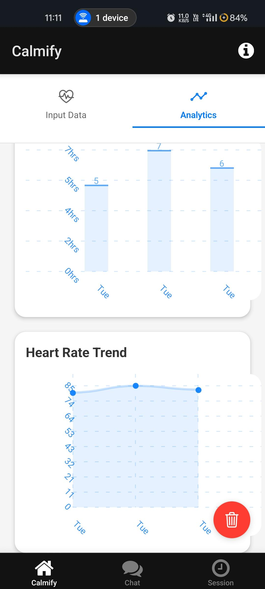
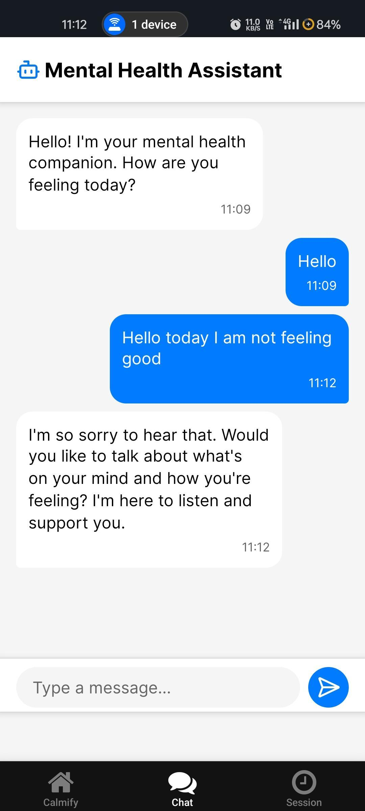
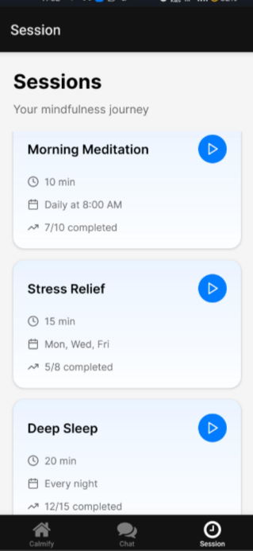

# Calmify -  Mental Health & Wellness App 🌟

## App Screenshots

<div style="display: flex; flex-wrap: wrap; gap: 20px; justify-content: center;">
  
  
  
  
</div>

## 🎯 Overview
Calmify is a comprehensive mental health and wellness application that combines advanced machine learning algorithms with user-friendly features to provide personalized mental health support. The app uses AdaBoost for stress detection and CNN for facial expression recognition, making it a powerful tool for monitoring and managing mental well-being.

## 🌿 What's Calmify All About?
Mental health matters — and Calmify is our take on using AI + accessible tech to support it.
💡 Currently available as a cross-platform mobile app, Calmify helps users monitor stress levels based on manually entered data — with smart predictions powered by machine learning.

## Features

- **Stress Prediction**: Track and predict stress levels based on health metrics
- **Sleep Analytics**: Monitor sleep duration, snoring rate, and heart rate
- **Guided Meditation**: Access to various meditation sessions with timer and background music
- **Chat Support**: AI-powered chat interface for mental health support
- **Sessions**: Schedule sessions and track your mental wellness journey
- **Appointments**: Booking Progfessional Therapist
- **Dark Mode**: Comfortable dark theme for all app screens

## Tech Stack

### Frontend
- React Native with Expo
- TypeScript
- React Navigation
- Expo AV for audio playback
- React Native Charts
- Theme Context for dark/light mode

### Backend
- Flask (Python)
- TensorFlow for stress prediction
- Hugging Face Transformers for chatbot
- RESTful API architecture

## 📁 Project Structure

```
calmify/
├── app/                           # Main application code
│   ├── (tabs)/                   # Tab-based navigation
│   │   ├── index.tsx            # Home screen
│   │   ├── analytics.tsx        # Analytics dashboard
│   │   ├── session.tsx         # Meditation sessions
│   │   └── appointments.tsx    # Appointment management
│   ├── components/             # Shared components
│   ├── services/               # API services
│   ├── _layout.tsx            # Root layout configuration
│   ├── modal.tsx              # Modal screens
│   ├── +html.tsx             # HTML configuration
│   └── +not-found.tsx        # 404 page
│
├── components/                    # Reusable components
│   ├── StressMonitor/           # Stress detection UI
│   ├── Charts/                  # Analytics visualizations
│   └── common/                  # Shared UI elements
│
├── context/                      # React Context providers
│   └── AppContext.tsx          # Global state management
│
├── utils/                        # Utility functions
│   ├── api.ts                  # API helpers
│   └── helpers.ts              # Common helpers
│
├── constants/                    # App constants
│   ├── theme.ts               # Theme configuration
│   └── config.ts             # App configuration
│
├── assets/                       # Static assets
│   ├── images/                # App images
│   ├── icons/                 # App icons
│   └── sounds/                # Audio files
│
├── .expo/                        # Expo configuration
├── node_modules/                 # Dependencies
├── app.json                      # Expo app configuration
├── package.json                  # Project dependencies
├── tsconfig.json                # TypeScript configuration
└── .gitignore                   # Git ignore rules
```


## Getting Started

### Prerequisites
- Node.js (v14 or higher)
- Python 3.8+
- Expo CLI
- Android Studio or Xcode for emulators

### Installation

1. Clone the repository
```bash
git clone https://github.com/BuiltByPurva/Calmify.git
cd calmify
```

2. Install frontend dependencies
```bash
cd calmify
npm install
```

3. Install backend dependencies
```bash
cd backend
python -m venv venv
source venv/bin/activate  # On Windows: venv\Scripts\activate
pip install -r requirements.txt
```

4. Set up environment variables
Create a `.env` file in the backend directory with:
```
FLASK_APP=app.py
FLASK_ENV=development
```

5. Start the backend server
```bash
cd backend
flask run
```

6. Start the frontend application
```bash
cd calmify
npx expo start
```

## Usage

1. **Input Health Data**: Enter your sleep hours, snoring rate, and heart rate
2. **View Analytics**: Check your stress prediction and health trends
3. **Meditation Sessions**: Start guided meditation sessions with timer and background music
4. **Chat Support**: Interact with the AI chatbot for mental health support
5. **Book Appointment**: Access to book appointment of professional therapist at your fingertips

## Contributing

1. Fork the repository
2. Create your feature branch (`git checkout -b feature/AmazingFeature`)
3. Commit your changes (`git commit -m 'Add some AmazingFeature'`)
4. Push to the branch (`git push origin feature/AmazingFeature`)
5. Open a Pull Request

## License

This project is licensed under the MIT License - see the [LICENSE](LICENSE) file for details.

## Acknowledgments

- [Expo](https://expo.dev/) for the React Native framework
- [Flask](https://flask.palletsprojects.com/) for the backend framework
- [TensorFlow](https://www.tensorflow.org/) for machine learning capabilities
- [Hugging Face](https://huggingface.co/) for the transformer models 
